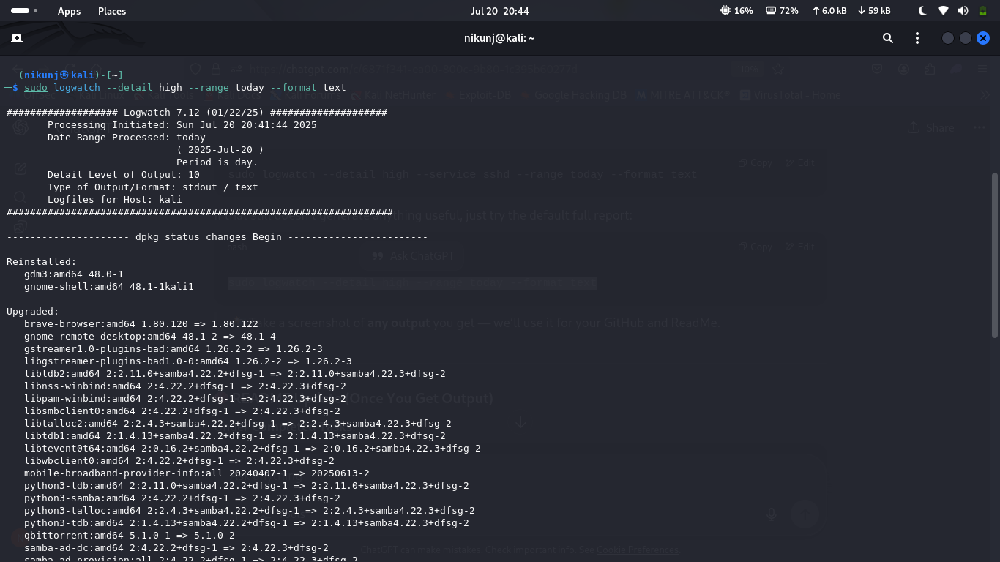
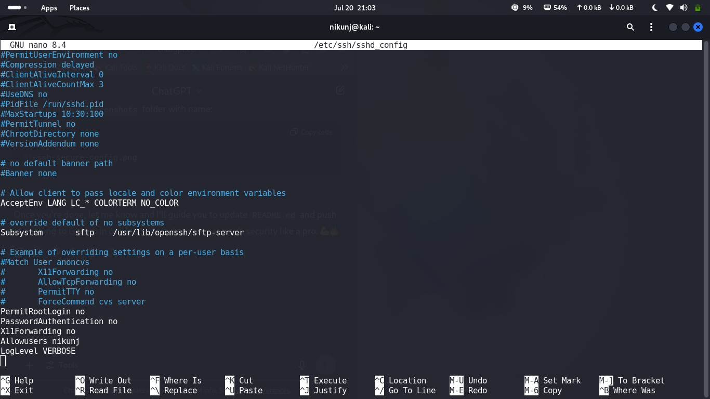
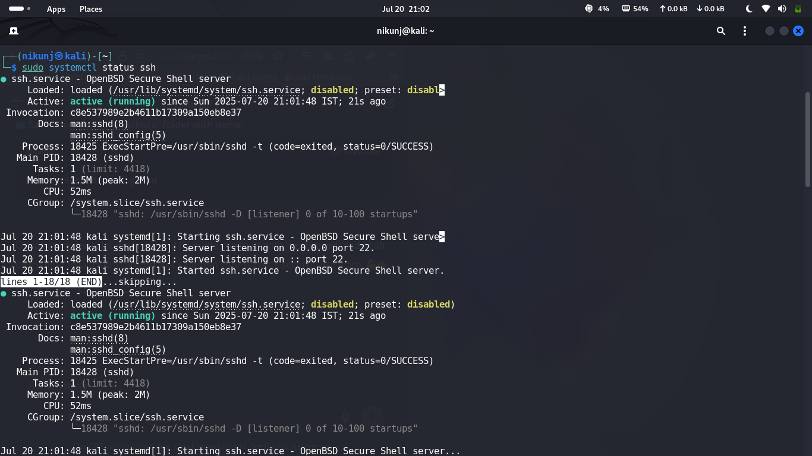

# 🔐 SSH Hardening on Kali Linux – Secure Like a Pro

This project is part of the Google Cybersecurity Certificate and demonstrates how to harden the SSH server on Kali Linux for better security and minimal attack surface.

---

## 🔍 Overview

SSH (Secure Shell) is powerful — but misconfigured, it's dangerous. In this mini-project, I configure and secure SSH using industry practices:

- Disable root login
- Disable password auth
- Limit user access
- Set strict log level
- Verify open ports
- Monitor SSH logs

---

## 🛠️ System Info

- **OS**: Kali Linux (Rolling)
- **Kernel**: `$(uname -r)`
- **Hostname**: `nikunj@kali`
- **SSH Version**: OpenBSD Secure Shell server

---

## ⚙️ Configuration Changes

**File Modified**: `/etc/ssh/sshd_config`

```bash
PermitRootLogin no
PasswordAuthentication no
X11Forwarding no
AllowUsers nikunj
LogLevel VERBOSE

sudo systemctl status ssh
sudo netstat -tuln | grep :22


🧪 Testing & Validation

    ✅ SSH service running

    ✅ Port 22 open and listening

    ✅ Login only allowed for user nikunj

    ✅ Root login and password authentication blocked

| Description              | Screenshot                              |
| ------------------------ | --------------------------------------- |
| SSH service status       |       |
| Edited sshd\_config      |      |
| SSH port open on netstat |     |
| Logwatch output          |  |


📦 Tools Used

    nano

    systemctl

    netstat

    logwatch

    ssh

🧠 Lessons Learned

    Why SSH root login is a risk

    How to enforce key-based auth only

    Using system logs to monitor brute-force attempts

    Importance of service-level hardening


🚀 Future Ideas

    Key-based login setup

    Fail2ban integration

    Auto-script for enterprise SSH config


🔗 Author

Nikunj Adatiya
GitHub: github.com/nik-cybersec
LinkedIn: www.linkedin.com/in/nikunj-adatiya-3a5bb72ab
